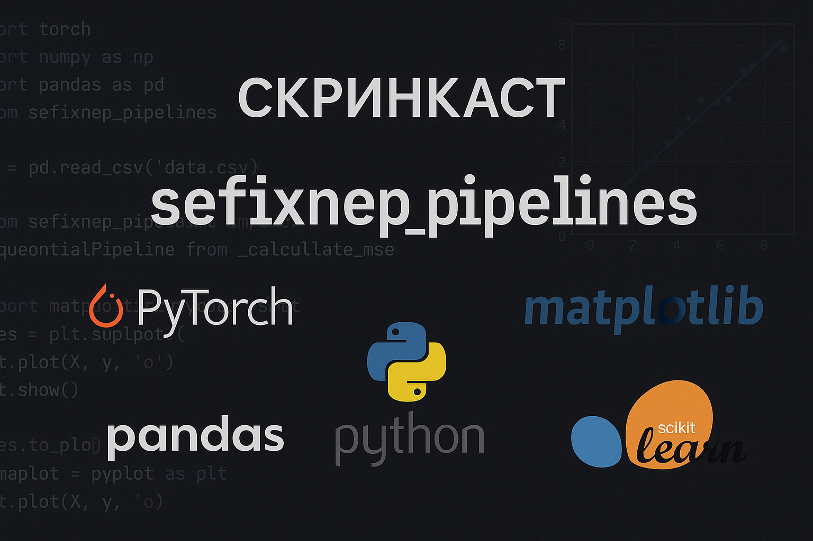

# 🚀 Модельные пайплайны

> 🆕 **UPDATE**: Добавлена поддержка классификации текста! Теперь вы можете использовать те же удобные пайплайны для работы с текстовыми данными.

<p align="left">
  <a href="https://www.youtube.com/watch?v=pzMqIQdTnek" target="_blank">
    
  </a>
</p>

<p align="left">
  <a href="https://www.youtube.com/watch?v=yanPBmg1rWA" target="_blank">
    
  </a>
</p>


## 💡 Что это умеет?

- ⚡ Быстрый старт пайплайна для классификации изображений и текста
- 🧠 Поддержка любых моделей для обучения (fine-tuning)
- 🛠️ Обёртка для `.fit()`, `.predict()`, `.save()`, `.load()` — без танцев
- 📈 LR Finder, визуализация предсказаний и простая адаптация под сабмит
- 🪄 Минимум кода, максимум гибкости (если знаешь, что делаешь)

---

## ⚙️ Установка

```bash
git clone https://github.com/Sefixnep/sefixnep_pipelines.git
cd sefixnep_pipelines
pip install -r requirements.txt
```

---

## 🔧 Что тебе нужно поменять

### 1. 📁 Данные

#### Для классификации изображений:
```python
classes = ["cat", "dog", "hedgehog"]                # название классов
data = ["images/cat1.jpg", "images/dog2.jpg", ...]  # пути к изображениям
labels = [0, 1, ...]  # метки, соответствующие изображениям (закодированные)
```

#### Для классификации текста:
```python
classes = ["positive", "negative", "neutral"]        # название классов
texts = ["Отличный продукт!", "Ужасное качество", ...]  # тексты для классификации
labels = [0, 1, ...]  # метки, соответствующие текстам (закодированные)
```

### 2. 🎨 Аугментации (по желанию)

#### Для изображений:
```python
augmentation = T.Compose([
    # можно добавить что угодно
])
```

### 3. 🧠 Выбор модели

#### Для изображений:
Вариант 1: Transformers

```python
model = CustomOutput(
    AutoModelForImageClassification.from_pretrained(
        "google/vit-base-patch16-224",
        num_labels=len(classes),
        ignore_mismatched_sizes=True
    )
)
```

Вариант 2: Torchvision models

```python
model = models.efficientnet_b0(weights=models.EfficientNet_B0_Weights.IMAGENET1K_V1)
model.classifier[-1] = nn.Linear(model.classifier[-1].in_features, len(classes))
```

Вариант 3: Собери свою

 - Вас никак не ограничивают в архитектуре модели, главное, чтобы ее выходами при вызове были логиты для обучения. Используйте CustomOutput в случае необходимости.
 - Модель должна соответствовать задаче, под которую создан пайплайн.

#### Для текста:
```python
model = CustomOutput(
    AutoModelForSequenceClassification.from_pretrained(
        "bert-base-uncased",
        num_labels=len(classes)
    )
)
```

### 4. 🏁 Обучение

```python
# Для изображений
model_wrapped = Classifier(model, "MyModel", optimizer)
model_wrapped.fit(train_loader, valid_loader, epochs=10)

# Для текста
model_wrapped = TextClassifier(model, "MyModel", optimizer)
model_wrapped.fit(train_loader, valid_loader, epochs=10)
```

### 5. 🧪 Предсказания

```python
# Для изображений
predict_class_id = best_model_wrapped.predict(test_set)
predict_class_proba = best_model_wrapped.predict_proba(test_set)
predict_class_names = [classes[class_id] for class_id in predict_class_id]

# Для текста
predict_class_id = best_model_wrapped.predict(test_texts)
predict_class_proba = best_model_wrapped.predict_proba(test_texts)
predict_class_names = [classes[class_id] for class_id in predict_class_id]
```

---

## 🤝 Ты получаешь пайплайн, где можно:

- Поставить пути — и сразу обучать
- Быстро подключить свои модели
- Не писать 300 строк под `.fit()`
- Дебажить красивой визуализацией.
- Найти подходящий LR, для обучения.

---

> ❗ P.S. Всё кастомизируемо. Нашли баг - пишите мне в [telegram](https://t.me/sefixnep)
